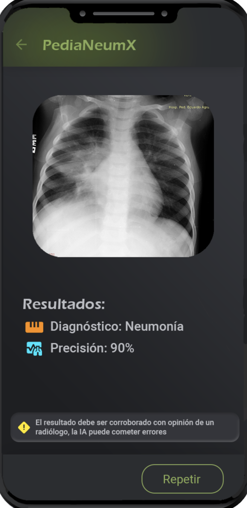
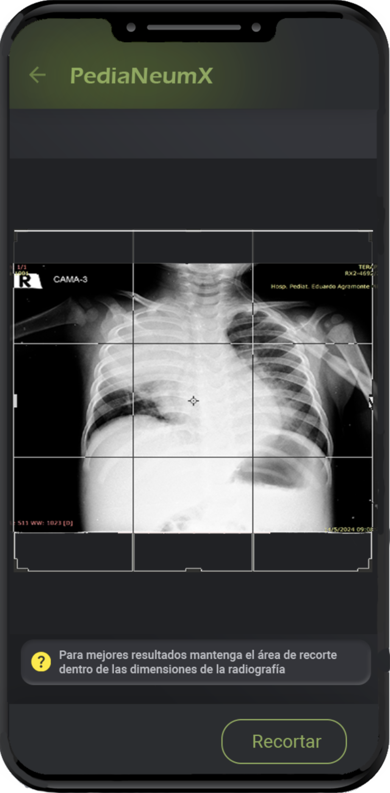
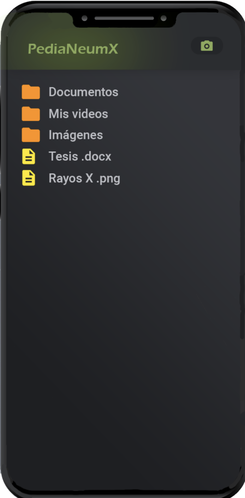
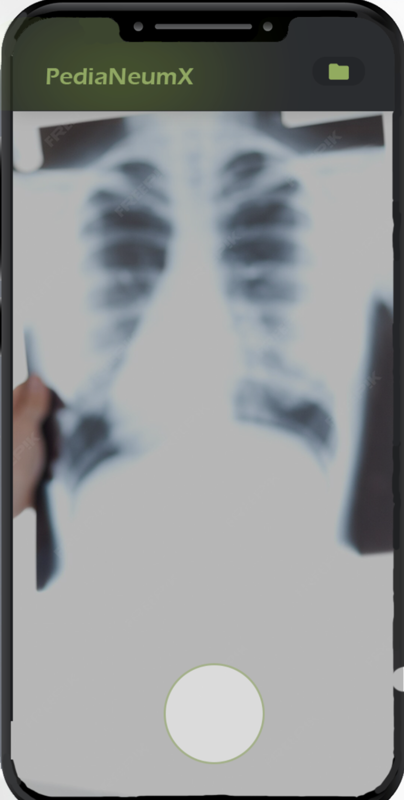

# PediaNeumX

An Android application that leverages on-device Machine Learning to assist in the early detection of pneumonia in pediatric patients through chest X-ray analysis.

> **Medical Disclaimer:** PediaNeumX is an AI-assisted screening tool and is **not** a substitute for professional medical diagnosis. All results must be confirmed by a qualified radiologist or physician.

---

## Screenshots

<p align="center">
  
  
  
  
</p>

---

## Features

- **X-ray capture** — Take a photo directly with the device camera or import from the gallery
- **Image cropping** — Crop and adjust the image before analysis for optimal results
- **On-device inference** — TensorFlow Lite model runs fully offline; no data is sent to external servers
- **Diagnosis result** — Classifies the X-ray as *Pneumonia* or *Non-Pneumonia* along with a confidence score
- **Doctor confirmation reminder** — Displays a persistent warning prompting clinicians to validate results

---

## Tech Stack

| Layer | Technology |
|---|---|
| Language | Kotlin |
| UI | Jetpack Compose + Material 3 |
| Architecture | MVVM |
| Dependency Injection | Hilt |
| Navigation | Jetpack Navigation Compose |
| Camera | CameraX |
| Image Loading | Coil |
| Image Cropping | android-image-cropper |
| ML Runtime | TensorFlow Lite |

---

## Requirements

- Android 8.0 (API 26) or higher
- Camera permission (for live capture)
- Storage permission (for image picker)

---

## Getting Started

1. **Clone the repository**
   ```bash
   git clone https://github.com/Marcial1234/PediaNeumX.git
   cd PediaNeumX
   ```

2. **Open in Android Studio** (Hedgehog or later recommended)

3. **Build and run**
   ```bash
   ./gradlew assembleDebug
   ```
   Or use the **Run** button in Android Studio targeting a physical device or emulator running API 26+.

---

## App Flow

```
Splash → Permissions → Camera / Gallery → Crop → Result
```

1. **Splash** — Entry point, initializes the app
2. **Permissions** — Requests camera and storage access
3. **Camera** — Capture a chest X-ray photo or pick one from the gallery
4. **Crop** — Adjust the image region before inference
5. **Result** — Displays the diagnosis label and confidence score with a doctor-confirmation warning

---

## Project Structure

```
app/src/main/java/com/qnecesitas/pedianeumx/
├── datamodel/          # Data classes and enums (Diagnosis)
├── navigation/         # Navigation graph, routes, and base ViewModel interfaces
├── ui/
│   ├── camera/         # Camera capture screen
│   ├── cropper/        # Image cropping screen
│   ├── main/           # App bars and scaffold
│   ├── permissions/    # Runtime permission handling
│   ├── result/         # Diagnosis result screen
│   ├── splash/         # Splash screen
│   └── theme/          # Colors, typography, and Material theme
└── utility/            # File and image utilities
```

---

## License

This project is licensed under the [MIT License](LICENSE).
